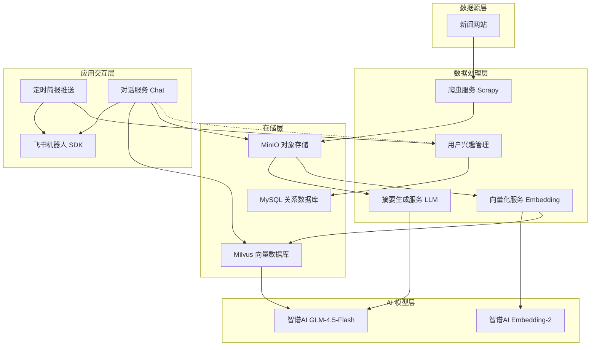

# 智能新闻助手

<div align="center">

一个基于 **RAG（检索增强生成）** 架构的智能新闻助手系统。

支持新闻自动爬取、AI 摘要生成、向量化存储、语义搜索，并通过飞书机器人提供自然语言交互。

[](https://www.python.org/)
[](https://www.langchain.com/)
[](https://milvus.io/)
[](https://open.feishu.cn/)

</div>

---

## 📖 项目概述

智能新闻助手能够自动从新闻网站抓取新闻，利用大模型生成摘要和向量化存储，并通过飞书机器人让用户以自然语言搜索和获取新闻推荐。

### 核心流程

```
爬虫抓取新闻 → MinIO 对象存储 → AI 摘要生成 → 向量化嵌入 → Milvus 向量数据库
                                                                    ↓
用户飞书提问 ← 意图识别 ← 语义搜索 ← LLM 归纳总结 ←──────────────────┘
```

---

## 🏗️ 系统架构



---

## ✨ 核心功能

| 功能模块 | 说明 |
|---------|------|
| 📰 **新闻爬取** | 基于 Scrapy，自动抓取新浪新闻（支持科技/财经/体育/军事等频道），存入 MinIO |
| 📝 **AI 摘要** | 调用智谱 GLM-4.5-Flash 大模型，自动为每条新闻生成 100-200 字摘要 |
| 🔢 **向量化** | 使用智谱 Embedding-2 模型将新闻转换为 1024 维向量，存入 Milvus |
| 🔍 **语义搜索** | 基于 Milvus 向量检索，将用户问题与新闻进行语义匹配 |
| 💬 **飞书对话** | 飞书 SDK 长连接接入，支持自然语言问答 |
| 🎯 **意图识别** | 智能识别用户意图（搜索/设置兴趣/帮助），自动路由处理 |
| ⭐ **兴趣管理** | 支持用户设置关注领域，个性化新闻推荐 |
| ⏰ **定时推送** | 每日定时生成并推送新闻简报 |

---

## 🚀 快速开始

### 环境要求

- Python 3.9+
- Docker 和 Docker Compose
- 智谱AI API Key（[获取地址](https://open.bigmodel.cn/)）

### 1. 克隆项目

```bash
git clone https://github.com/czh749/news-assistant.git
cd news-assistant
```

### 2. 安装依赖

```bash
# 创建虚拟环境
conda create -n ainews python=3.9
conda activate ainews

# 安装 Python 依赖
pip install -r requirements.txt
```

### 3. 配置环境变量

```bash
# 复制配置文件模板
cp .env.example .env

# 编辑 .env，填入你的 API Key
# 必填：ZHIPU_API_KEY
# 可选：FEISHU_APP_ID（使用飞书功能时需要）
```

### 4. 启动基础服务

使用 Docker Compose 启动 MySQL、MinIO、Milvus：

```bash
docker-compose up -d
```

服务说明：
- **MySQL**：`localhost:3306`（用户数据、兴趣管理）
- **MinIO**：`localhost:9000`（新闻存储），控制台 `localhost:9001`
- **Milvus**：`localhost:19530`（向量数据库），可视化 `localhost:8000`

### 5. 初始化数据库

首次启动时，MySQL 会自动执行 `sql/init_database.sql`。如需手动重新执行：

```bash
# 连接 MySQL 执行初始化脚本
docker exec -i mysql-news mysql -uroot -p123456 news_db < sql/init_database.sql
```

### 6. 启动应用

```bash
# 启动完整服务（飞书机器人 + 定时任务 + 后台处理）
python main.py start

# 或单独运行功能：
python main.py crawler    # 手动爬取新闻
python main.py summary    # 生成新闻摘要
python main.py embedding  # 生成向量
```

---

## 📁 项目结构

```
news-assistant/
├── main.py                      # 统一入口
├── requirements.txt             # Python 依赖
├── docker-compose.yml           # Docker 服务编排
├── .env.example                 # 环境变量模板
│
├── bot/                         # 飞书机器人模块
│   ├── feishu_bot.py            # 消息加解密、发送
│   ├── feishu_sdk_client.py     # SDK 长连接客户端（推荐）
│   └── webhook_server.py        # Webhook 模式服务器
│
├── config/                      # 配置模块
│   └── settings.py              # 统一配置管理
│
├── storage/                     # 存储层封装
│   ├── minio_client.py          # MinIO 对象存储客户端
│   ├── mysql_client.py          # MySQL 数据库客户端
│   └── milvus_client.py         # Milvus 向量数据库客户端
│
├── models/                      # 数据模型
│   └── news.py                  # 新闻数据类
│
├── services/                    # 业务服务层
│   ├── chat_service.py          # 对话服务（核心）
│   ├── intent_service.py        # 意图识别服务
│   ├── summary_service.py       # 摘要生成服务
│   ├── embedding_service.py     # 向量化服务
│   ├── scheduler_service.py     # 定时任务服务
│   └── user_service.py          # 用户兴趣管理服务
│
├── sina_news/                   # Scrapy 爬虫
│   └── sina_news/
│       ├── spiders/sina.py      # 新浪新闻爬虫
│       ├── pipelines.py         # MinIO 存储 + 去重
│       ├── items.py             # 数据项定义
│       └── settings.py          # 爬虫配置
│
├── embedding.py                 # 向量嵌入封装
├── LLM.py                       # 大模型调用封装
│
├── sql/                         # 数据库初始化脚本
│   └── init_database.sql
│
├── 智能新闻助手.md               # 架构设计文档
└── 开发计划.md                   # 开发计划文档
```

---

## 🔧 技术栈

| 层级 | 技术 | 说明 |
|------|------|------|
| **大模型** | 智谱AI GLM-4.5-Flash | 摘要生成、对话总结 |
| **向量模型** | 智谱AI Embedding-2 | 文本向量化（1024维）|
| **爬虫** | Scrapy 2.x | 新闻网站内容抓取 |
| **对象存储** | MinIO | 新闻 JSON 文件存储 |
| **向量数据库** | Milvus 2.x | 语义检索、相似度搜索 |
| **关系数据库** | MySQL 8.0 | 用户数据、兴趣管理 |
| **LLM 框架** | LangChain | 统一 AI 模型调用接口 |
| **通信渠道** | 飞书开放平台 SDK | WebSocket 长连接 |
| **定时任务** | APScheduler | 每日简报、定时爬取 |
| **容器化** | Docker Compose | 一键部署基础服务 |

---

## 💡 使用示例

### 爬取新闻

```bash
# 爬取今天的新浪新闻
python main.py crawler

# 或通过 Scrapy
cd sina_news
scrapy crawl sina -a max_news=10
```

### 生成摘要和向量

```bash
# 自动模式：服务启动后自动轮询处理
python main.py start

# 手动模式：运行一次处理
python main.py summary     # 生成摘要
python main.py embedding   # 生成向量
```

### 飞书机器人

1. 在飞书开发者平台创建应用
2. 配置 `.env` 中的飞书凭证
3. 启动服务：`python main.py start`
4. 在飞书中与机器人对话：

```
用户：搜索量子计算机新闻
机器人：[返回相关新闻标题、摘要、链接]

用户：我对AI感兴趣
机器人：已记录你的兴趣：AI

用户：帮助
机器人：我是新闻助手，可以帮你搜索新闻...
```

---

## 📚 文档

- [架构设计文档](智能新闻助手.md) - 系统架构、技术选型、实施路线图
- [开发计划文档](开发计划.md) - 详细的 10 天开发计划

---

## ⚠️ 注意事项

1. **API Key 安全**：切勿将 `.env` 文件提交到公开仓库，项目已配置 `.gitignore`
2. **Docker 服务**：首次启动需要拉取镜像，请确保网络畅通
3. **智谱 API 费用**：GLM-4.5-Flash 约 ¥0.0005/千 tokens，Embedding-2 约 ¥0.0005/千 tokens
4. **飞书配置**：使用飞书功能需要在飞书开发者平台创建应用并选择"长连接"模式

---

## 📄 License

MIT License
