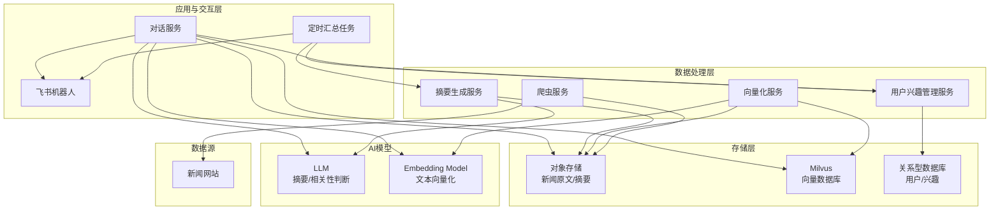

## 一、 整体架构与核心流程

新的架构图明确了数据流、控制流和交互流的分离，使得系统职责更清晰。

**核心流程说明：**

1.  **数据采集与处理流**：
    *   `爬虫服务(B)` 从 `新闻网站(A)` 抓取内容，存入 `对象存储(E)`。
    *   `向量化服务(D)` 监听或定期扫描 `对象存储(E)` 中的新内容，调用 `Embedding Model(L)` 生成向量，并存入 `Milvus(F)`。
    *   `摘要生成服务(C)` 同样处理 `对象存储(E)` 的新内容，调用 `LLM(K)` 生成摘要，并将结果存回 `对象存储(E)`。同时，它可能需要将处理状态等信息写入 `关系型数据库(G)`。

2.  **定时推送流**：
    *   `定时汇总任务(H)` 按计划（如每日清晨）触发。
    *   它调用 `摘要生成服务(C)` 的特定接口，获取过去24小时的新闻并生成一份“每日简报”。
    *   任务完成后，通过 `飞书机器人(I)` 将简报推送给指定用户或群组。

3.  **用户交互流**：
    *   用户在飞书中与机器人对话，消息由 `飞书机器人(I)` 接收并转发给 `对话服务(J)`。
    *   `对话服务(J)` 是核心的交互大脑：
        *   解析用户意图（是设定兴趣还是搜索新闻）。
        *   若是搜索，则调用 `Embedding Model(L)` 将用户问题向量化，然后去 `Milvus(F)` 检索相关新闻。
        *   从 `对象存储(E)` 获取新闻原文/摘要，并结合用户问题，调用 `LLM(K)` 进行归纳和回答。
        *   若是设定兴趣，则将信息存入 `关系型数据库(G)`。
    *   最终，`对话服务(J)` 将结果通过 `飞书机器人(I)` 返回给用户。

---

## 二、 POC阶段技术选型建议

此前的技术选型依然完全适用，因为它聚焦于POC的“快速验证”目标。

| 模块         | 推荐技术栈                                | 选型理由                       |
| :--------- | :----------------------------------- | :------------------------- |
| **后端服务**   | **Python**                           | 生态成熟，AI/数据科学库丰富，开发效率高。     |
| **对象存储**   | **MinIO (本地)                         | MinIO本地零成本，兼容S3 API。       |
| **AI模型**   | **智谱AI GLM-4.5-Flash / Embedding-3** | 性价比高，API调用便捷，中文效果优秀，技术栈统一。 |
| **向量数据库**  | **Milvus (Docker)**                  | 业界标杆，性能优异，Docker部署简单。      |
| **关系型数据库** | **MySQL**                            | 成熟稳定，满足POC及未来扩展需求，生态完善。    |
| **定时任务**   | **APScheduler**                      | 轻量级Python库，易于集成和管理。        |
| **通信渠道**   | **飞书开放平台 SDK**                       | 官方支持，提供丰富的机器人交互能力。         |

---

## 三、 POC阶段实施路线图

新的架构让我们的实施步骤可以更加模块化。

### 第一阶段：构建独立的数据处理服务

**目标**：让爬虫、摘要、向量化三个核心服务能够独立、自动化地运行。

1.  **开发爬虫服务(B)**：独立运行一个Python脚本或服务，定期抓取新闻，以JSON格式存入MinIO。
2.  **开发向量化服务(D)**：
    *   创建一个向量服务类。
    *   提供一个`process`接口，接收MinIO中的文件路径，读取内容，调用`Embedding-3`生成向量，存入Milvus。
    *   可以用一个简单的脚本轮询MinIO，一旦发现新文件就调用此接口。
3.  **开发摘要生成服务(C)**：
    *   创建另一个摘要生成服务类。
    *   同样提供`process`接口，读取新闻，调用OpenAI API生成摘要，并将摘要存回MinIO（可以更新原JSON文件）。
    *   同样用脚本轮询触发。

### 第二阶段：实现用户交互核心

**目标**：让用户能够通过飞书与机器人对话，并完成新闻搜索。

1.  **搭建对话服务(J)**：
    *   集成飞书SDK，配置消息接收和发送的Webhook。
2.  **实现对话逻辑**：
    *   在服务中，编写消息路由逻辑。例如，检测到“搜索”、“查询”等关键词时，走搜索流程。
    *   **搜索流程**：将用户问题向量化 -> 查询Milvus -> 获取新闻原文 -> 调用LLM归纳 -> 返回结果。
3.  **实现兴趣设定**：
    *   检测到“关心”、“关注”等关键词时，走兴趣设定流程。
    *   将用户ID和兴趣文本存入Mysql数据库(G)。
### 第三阶段：实现自动化推送与整合

**目标**：完成定时推送功能，并将所有模块整合成一个完整的POC产品。

1.  开发定时汇总任务(H)：
    *   创建一个独立的Python脚本，使用APScheduler设定每日执行时间。
    *   脚本内部逻辑：
        a. 调用`摘要生成服务(C)`的一个新接口（如`generate_daily_report`），该接口负责汇总昨日新闻并调用LLM生成简报。
        b. 获取到简报内容后，调用飞书机器人API，直接推送给目标用户/群。
2.  整合与测试：
    *   将所有服务（爬虫、摘要、向量化、对话）通过Docker Compose进行编排，实现一键启动。
    *   进行端到端测试：从新闻被抓取，到用户能搜索到，再到第二天收到日报，验证整个链路。1. **  
3. 端到端测试：完整验证“数据采集->用户搜索->定时推送”全链路。

**产出**：一个功能完整、架构清晰、可演示的POC产品。
